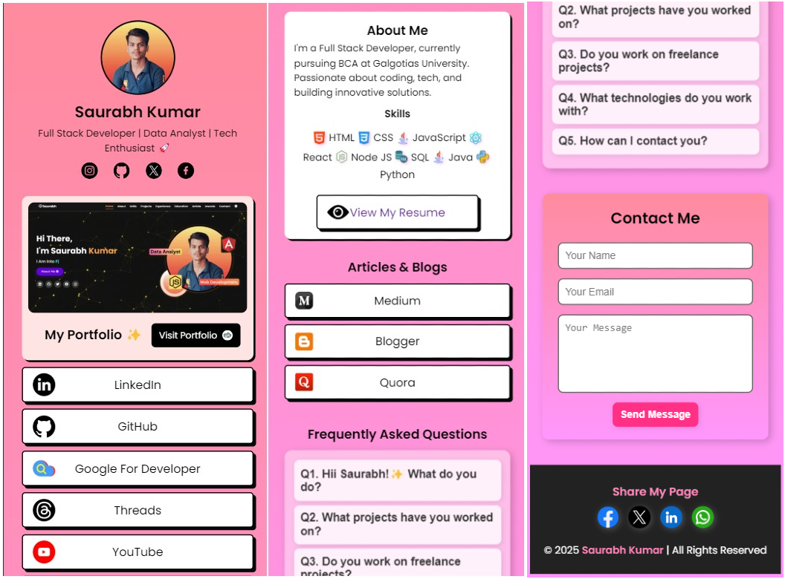
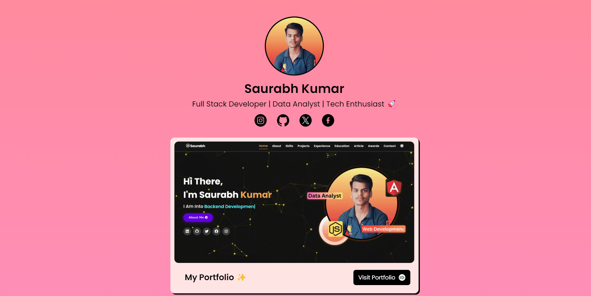

---

### **📌 LinkVerse - Your Digital Identity in One Place! 🚀**  
_A sleek and modern LinkTree alternative with a stylish UI, social media links, a portfolio section, FAQs, and a contact form._

  

---

## 🌟 **Features**
✅ **Profile Section** – Display your picture, name, and social media icons.  
✅ **Stylish Links** – Add links with images, hover effects, and smooth animations.  
✅ **Portfolio Showcase** – Highlight your portfolio with an elegant design.  
✅ **About Me** – Introduce yourself with skills and a brief bio.  
✅ **FAQs (Accordion)** – Users can toggle questions with a smooth dropdown effect.  
✅ **Contact Form** – Let visitors reach out to you easily.  
✅ **Responsive Design** – Fully optimized for mobile and desktop.  

---

## 🚀 **Live Demo**
🔗 **[View Live](https://links-g2.vercel.app/)**  

---

## 🖥️ **Tech Stack**
- **Frontend**: HTML, CSS, JavaScript  
- **Form Handling**: [Formspree](https://formspree.io/) 
- **Icons & Fonts**: Font Awesome, Google Fonts  
- **Animations**: CSS Hover Effects & Transitions  

---

## 🎨 **Screenshots**
| Desktop View | Mobile View |
|-------------|------------|
|  |  |

---

## 📌 **Installation & Setup**
1. **Clone the repository**  
   ```bash
   git clone https://github.com/saurabhtbj1201/LinkVerse.git
   ```
2. **Navigate into the folder**  
   ```bash
   cd LinkVerse
   ```
3. **Open `index.html` in your browser**  
   - For live preview, use **Live Server** in VS Code.  

---

## 🔧 **Customization**
🖼️ **Update Your Profile Picture** – Replace `images/profile.jpg` with your own.  
🔗 **Edit Your Links** – Modify the `<a href="">` in `index.html`.  
🎨 **Change Theme Colors** – Edit `styles.css`.  

---

## 📬 **Contact**
📧 **Email:** Saurabhtbj143@outlook.com
🔗 **Portfolio:** (https://www.gu-saurabh.tech/)  

---

## 💖 **Contribute**
Love this project? Feel free to **fork**, **star**, and **contribute**! 🚀  

```bash
git fork https://github.com/saurabhtbj1201/LinkVerse.git
git clone https://github.com/saurabhtbj1201e/LinkVerse.git
```

---

## 📜 **License**
This project is **open-source** under the [MIT License](LICENSE).  

---

🔹 *Designed & Developed by [Saurabh Kumar](https://www.gu-saurabh.tech/)* 💙  

---

**Let me know if you want any changes! 🚀🔥**
